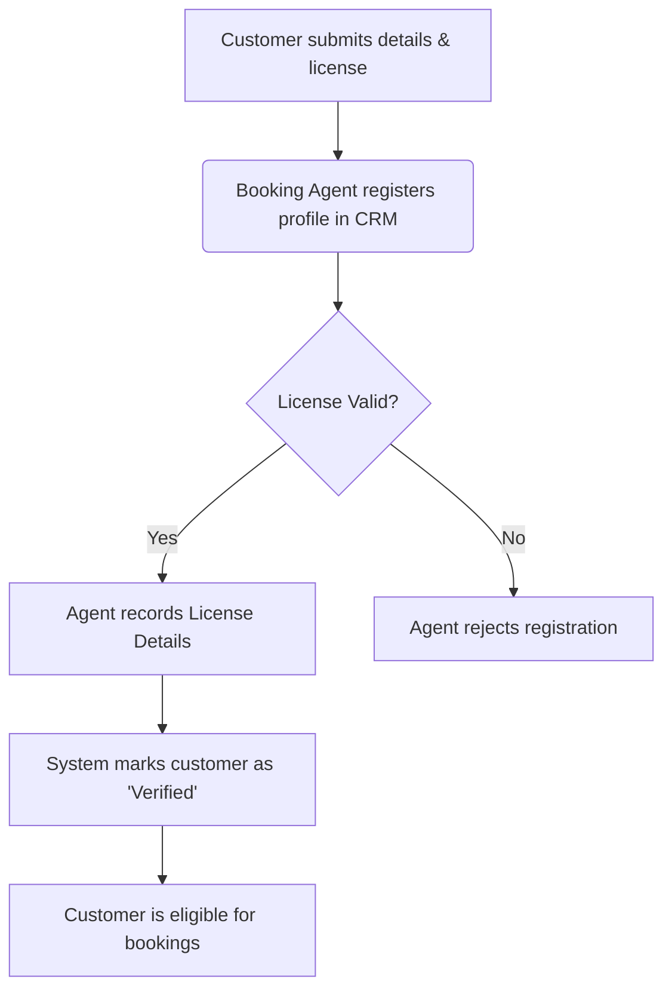
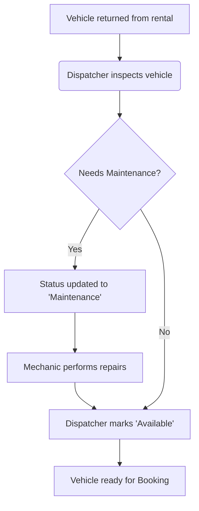
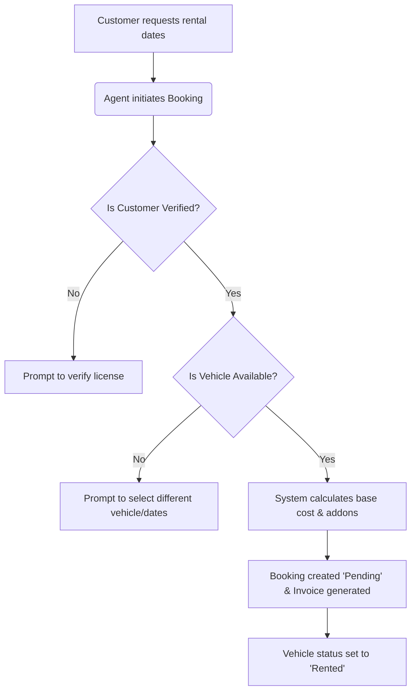
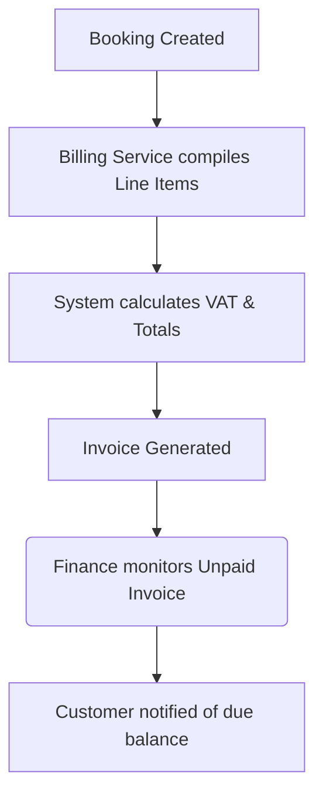
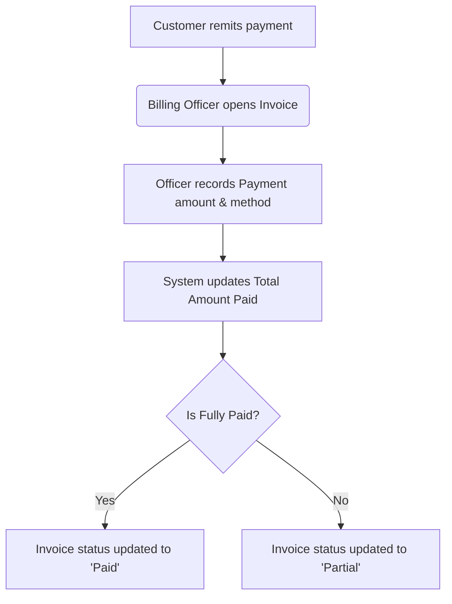

# Business Documentation
**Project:** SwiftRide ERP
**Course:** Microservices Architecture and Deployment (Endterm Mini ERP System)

---

## 1. Company Profile

**Company Name:** SwiftRide Rentals Inc.
**Industry:** Car Rental and Logistics
**Size:** Regional Operations (approx. 50+ employees)
**Locations:** 
- Manila Head Office (Main Branch)
- Cebu Hub (Logistics & Fleet Operations)
- Bacolod Hub (Regional Branch)

**Mission Statement:** 
To provide seamless, reliable, and accessible vehicle rental solutions for individuals and enterprises across the region, leveraging modern technology to deliver exceptional customer experiences and optimized fleet logistics.

**Operational Model & Industry Inspiration:**
The core business workflows of SwiftRide Rentals—specifically Customer Verification, Fleet Allocation, and Upfront Billing—are strictly modeled after industry-standard practices utilized by major global car rental agencies such as Enterprise Rent-A-Car and Hertz. This ensures a highly realistic, scalable, and practical approach to fleet management and order orchestration.

---

## 2. Organizational Structure

SwiftRide Rentals operates across four primary departments that interact closely with the ERP system:

1. **Executive / Admin Department**
   - **Roles:** System Administrator, General Manager
   - **Responsibilities:** Overseeing operations across all hubs, defining system configurations, managing employee access, and reviewing high-level analytics.
2. **Fleet & Logistics Department**
   - **Roles:** Dispatcher, Maintenance Supervisor
   - **Responsibilities:** Tracking vehicle availability, managing maintenance schedules, allocating vehicles to bookings, and logging fleet statuses.
3. **Sales & Customer Service Department**
   - **Roles:** Booking Agent, Customer Service Representative (CSR)
   - **Responsibilities:** Managing customer profiles, validating driver's licenses, creating and updating reservations, and assisting clients.
4. **Finance & Accounting Department**
   - **Roles:** Billing Officer, Accountant
   - **Responsibilities:** Tracking revenues, issuing itemized invoices, recording customer payments, and managing refunds or deposits.

---

## 3. Core Business Processes

### 3.1. Customer Onboarding & Verification

Before a client can rent a vehicle, they must be registered and their driver's license must be verified to ensure compliance and liability protection.

### 3.2. Fleet Allocation & Status Update

Dispatchers must continuously monitor the fleet to ensure vehicles are available for incoming bookings and are sent to maintenance when required.

### 3.3. Booking Orchestration

Creating a reservation is a cross-departmental process that checks customer eligibility and vehicle availability simultaneously.

### 3.4. Billing & Invoicing

An upfront billing model ensures that the exact charges for the rental duration and any selected addons are invoiced immediately upon booking creation.

### 3.5. Payment Collection & Settlement

The Finance department processes customer payments against generated invoices.

---

## 4. Pain Points Addressed & System Traceability

Before adopting SwiftRide ERP, the company suffered from operational inefficiencies. The new microservices architecture was specifically designed to trace back to and resolve these exact pain points:

1. **Disjointed Data Silos & Double Bookings**
   - *Pain Point:* Customer records, vehicle inventory, and billing were managed in separate spreadsheets, causing frequent double-bookings and lost revenue.
   - *ERP Solution:* Implemented the **Booking Orchestration** service with synchronous REST communication to the Fleet and CRM services. This guarantees strict real-time consistency (ACID compliance via PostgreSQL) to prevent race conditions during booking creation.

2. **Manual Invoice Calculation Errors**
   - *Pain Point:* Calculating daily rates multiplied by days, plus individual addon rates and taxes, resulted in human errors and billing disputes.
   - *ERP Solution:* Implemented an automated **Billing Service** that compiles itemized line items instantly upon booking creation, enforcing standardized mathematical accuracy and tax inclusions.

3. **Lack of Real-time Fleet Visibility**
   - *Pain Point:* Dispatchers could not instantly see which vehicles were available, in maintenance, or currently rented out.
   - *ERP Solution:* Developed the **Fleet Service** with an intuitive UI dashboard that allows dispatchers to toggle vehicle statuses instantly, providing a single source of truth for inventory.

4. **Liability Risks from Unverified Drivers**
   - *Pain Point:* A lack of strict system-level enforcement allowed unverified customers to drive off with vehicles, leading to liability risks.
   - *ERP Solution:* Integrated a strict `is_verified` boolean check in the **CRM Service**. The Booking Service is programmed to reject any reservation attempt if the associated customer profile lacks a verified driver's license.

5. **Delayed Payment Tracking**
   - *Pain Point:* Identifying which customers had outstanding balances required manual cross-referencing between bank statements and booking contracts.
   - *ERP Solution:* The **Billing Service** explicitly tracks payment statuses (`unpaid`, `partial`, `paid`) and aggregates customer balances in real-time.

---

## 5. User Roles and Permissions

The system utilizes Role-Based Access Control (RBAC) enforced by the API Gateway to restrict access to sensitive business functions.

| Feature / Microservice | Admin | Dispatcher | Booking Agent | Billing Officer |
| :--- | :---: | :---: | :---: | :---: |
| **User/Auth Management** | Full Access | No Access | No Access | No Access |
| **Fleet Inventory (Add/Edit)** | Full Access | Read/Update Status | Read-Only | Read-Only |
| **Customer Profiles (CRM)** | Full Access | Read-Only | Full Access | Read-Only |
| **Driver's License Verification**| Full Access | No Access | Full Access | No Access |
| **Booking Creation** | Full Access | Read-Only | Full Access | Read-Only |
| **Booking Status Updates** | Full Access | Full Access | Full Access | Read-Only |
| **Invoice Generation** | Full Access | No Access | Auto-Triggered | Full Access |
| **Record Payments** | Full Access | No Access | No Access | Full Access |
