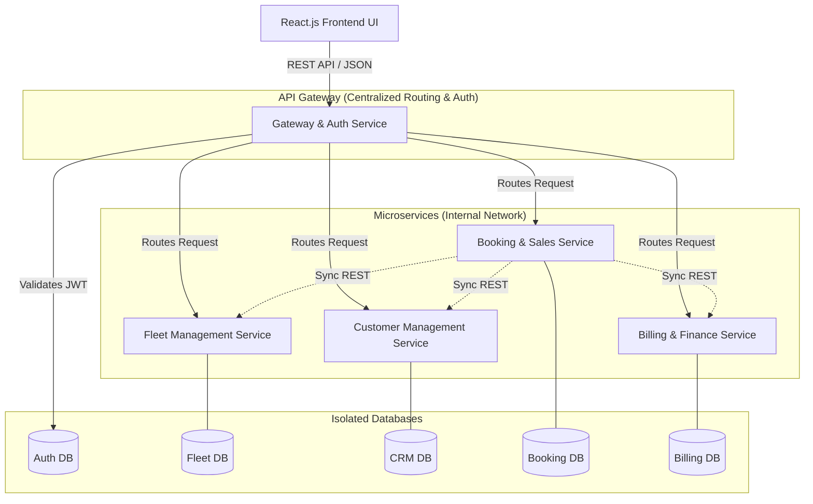
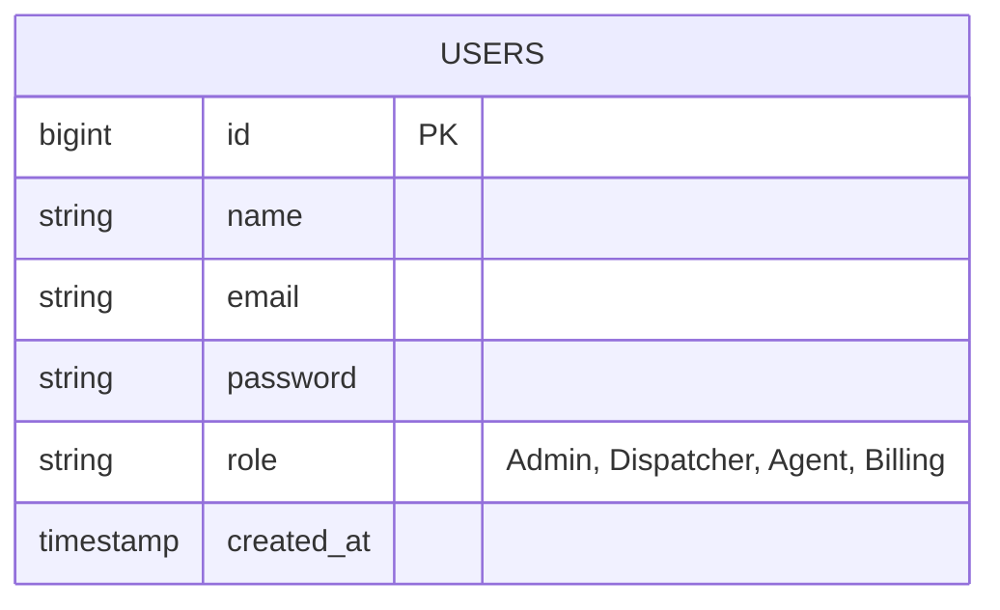
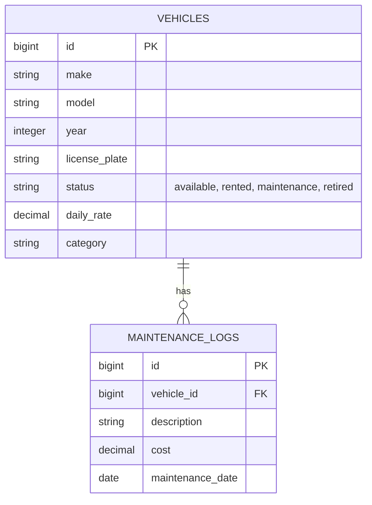
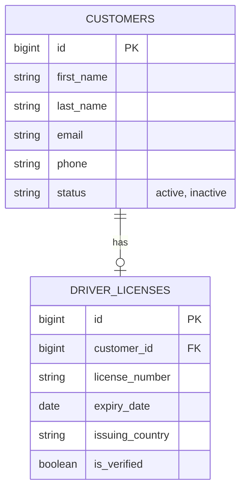
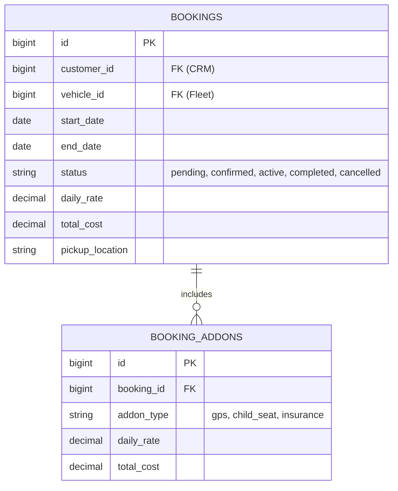
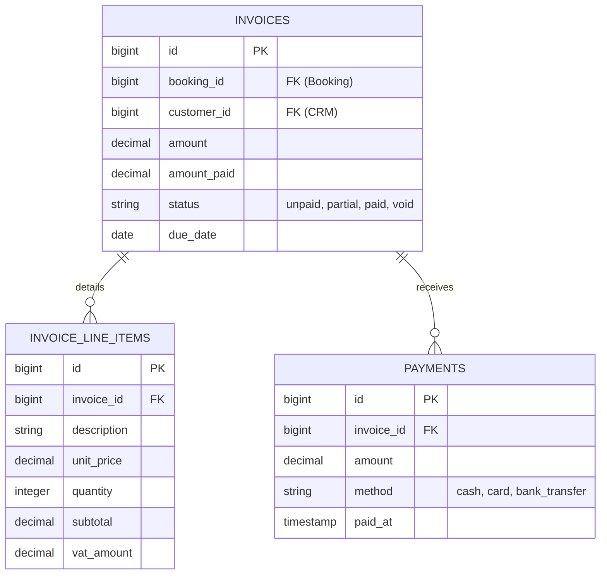

# Technical Documentation
**Project:** SwiftRide ERP
**Course:** Microservices Architecture and Deployment (Endterm Mini ERP System)

---

## 1. Architecture Design

The SwiftRide ERP system is built using a strict Microservices Architecture. The backend is decoupled into five independent services, all written in Laravel 11. Each service operates in its own container and connects to its own dedicated PostgreSQL database, strictly avoiding shared databases.

### 1.1. High-Level Architecture Diagram

---

## 2. Data Models (Entity-Relationship)

Because shared databases are prohibited, each microservice manages its own schema. References to entities in other services are stored as foreign key integers (e.g., `customer_id` in the Booking service refers to the primary key in the CRM service).

### 2.1. Gateway & Auth Service Data Model

### 2.2. Fleet Service Data Model

### 2.3. CRM Service Data Model

### 2.4. Booking Service Data Model

### 2.5. Billing Service Data Model

---

## 3. Inter-Service Communication

**Method Chosen:** Synchronous REST API over internal network via HTTP.

**Justification:** 
Synchronous REST communication was chosen primarily for the **Booking Orchestration** workflow. When an agent creates a booking, the system *must* verify in real-time that the vehicle is available (Fleet Service) and the customer is eligible (CRM Service) before finalizing the reservation contract. A synchronous approach guarantees strict consistency at the moment of creation, preventing race conditions or double bookings that could occur with an asynchronous message broker (like RabbitMQ) under high concurrency. 

Laravel's native HTTP Client (`Illuminate\Support\Facades\Http`) is utilized with strict timeouts (`timeout(5)`) to ensure that if a dependent service is unreachable, the request gracefully fails rather than hanging the entire application.

---

## 4. API Specifications

Comprehensive API documentation for each individual microservice has been generated. These documents outline every endpoint, expected request payload, response format, and required JWT authorization scopes. They serve as the formal API specifications for the system, fulfilling the project requirements (acting as the equivalent of Postman/OpenAPI documentation).

Please refer to the following API specification files in the `/docs` directory:
- [API Gateway & Auth Service](gateway-auth-service.md)
- [Fleet Service](fleet-service.md)
- [CRM Service](crm-service.md)
- [Booking Service](booking-service.md)
- [Billing Service](billing-service.md)

---

## 5. Technology Stack Justification

1. **Backend Framework: Laravel 11 (PHP)**
   Laravel was chosen for all core microservices due to its rapid API development capabilities. Its robust built-in routing, Eloquent ORM, and integrated HTTP client drastically reduce boilerplate code, allowing the team to focus on implementing complex business logic rather than writing basic database connection scripts.

2. **Database: PostgreSQL 16**
   PostgreSQL was selected for all microservice databases because of its strong adherence to ACID compliance, which is critical for an ERP handling financial and booking transactions. Its robust JSON column support also allows for flexible schema evolution without sacrificing relational integrity.

3. **Frontend: React.js (Vite)**
   React was utilized for the web interface due to its component-based architecture. Building a reusable component library (for modals, tables, and forms) ensured a consistent design system across the entirely of the ERP. Vite was chosen over Create React App (CRA) for significantly faster Hot Module Replacement (HMR) and optimized production builds.

4. **Containerization: Docker & Docker Compose**
   Docker is essential to enforce the microservices architecture constraint. By containerizing each service, we guarantee that there are no hidden dependencies on the host machine. Docker Compose orchestrates the internal DNS, allowing services to communicate with one another using simple hostnames (e.g., `http://booking:8000`) rather than brittle IP addresses.
