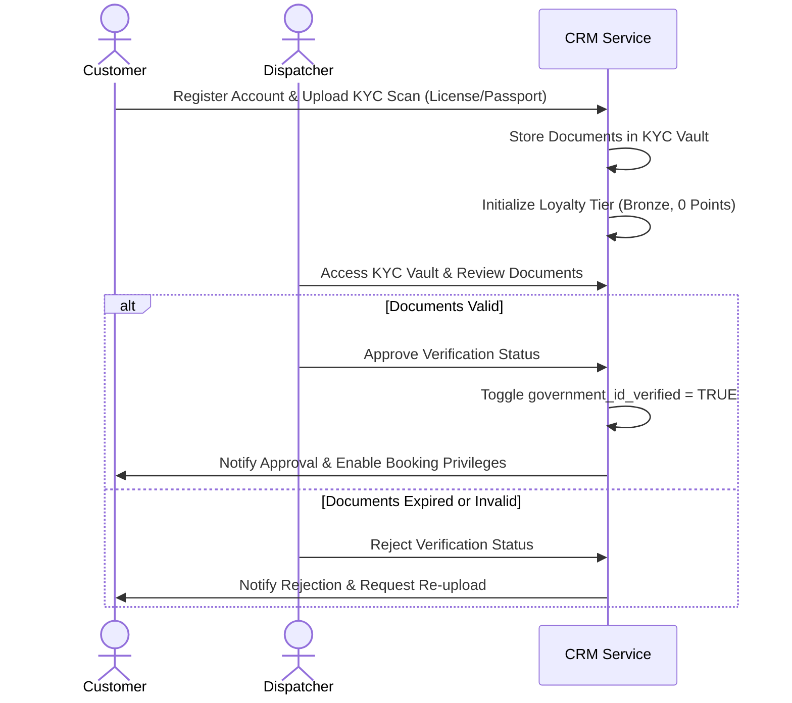
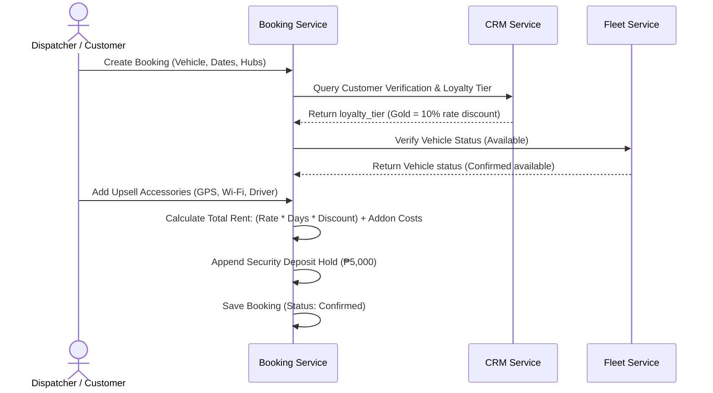
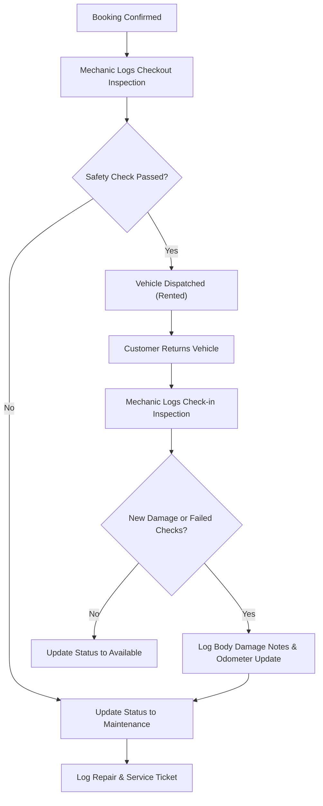
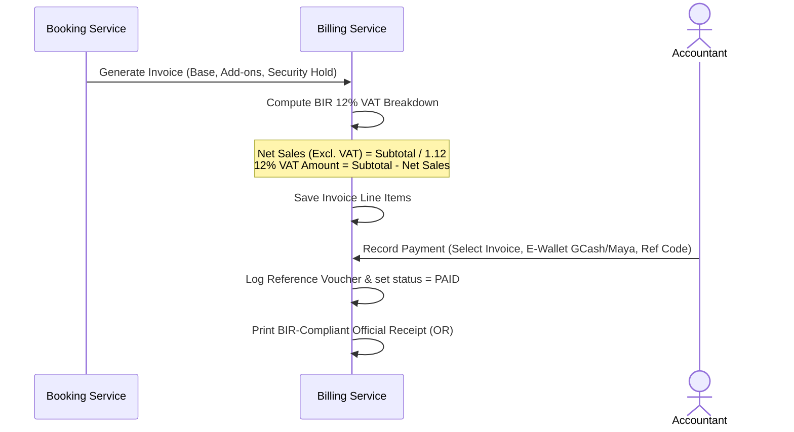
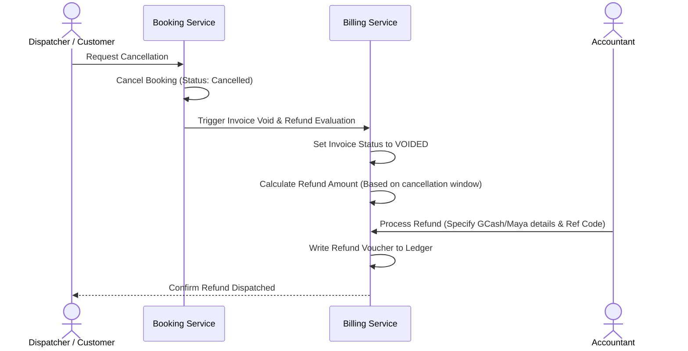
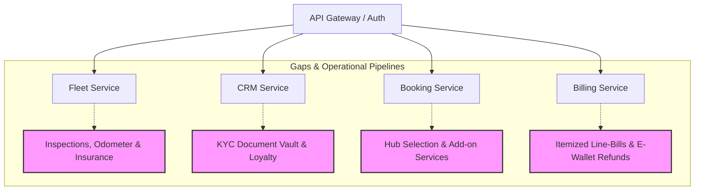

# **SwiftRide ERP — Enterprise Systems & Domain Gap Analysis**
**Role:** Senior Systems Analyst  
**Date:** May 21, 2026  

---

## **Executive Summary**
SwiftRide ERP is a containerized microservices platform built on Laravel and React, orchestrated via Docker Compose. It leverages an API Gateway for request proxying, JWT-based security, and localized Philippine seed datasets. The system covers four core functional modules (Fleet, CRM, Bookings, and Billing) alongside an Auth gateway, satisfying the technical competencies in the **Endterm Mini ERP Project Brief**.

This gap analysis reviews the SwiftRide platform against standard enterprise business workflows, regulatory compliance, and security demands. It maps out the organizational profile, pinpoints operational pain points, and establishes a permissions matrix. Additionally, it details 5 core end-to-end business processes (with Mermaid diagrams) to transition SwiftRide from a minimal admin tool into a production-grade, B2C-scalable logistics and Enterprise Resource Planning ecosystem.

---

## **1. Company Profile & Organizational Structure**

### **1.1 Company Profile**
* **Name:** SwiftRide Logistics & Car Rental Corp.
* **Industry:** Car Rental, Fleet Leasing, and Last-Mile Logistics
* **Size:** Medium Enterprise (120+ Employees, 150+ Vehicles)
* **Locations:** Nationwide Philippine Hubs (Manila Head Office, NAIA Airport T3 Hub, Cebu City Hub, Davao City Hub)
* **Mission Statement:** *"To deliver seamless, safe, and transparent transportation and vehicle rental solutions across the Philippine archipelago through state-of-the-art logistics and digital enterprise systems."*

### **1.2 Organizational Departments & Roles**
The ERP system bridges four distinct organizational units, each mapped to unique user roles with strict separation of duties (SoD):
```
                       [System Administrator]
                                 │ (Full Access & RBAC Controls)
         ┌───────────────────────┼───────────────────────┐
         ▼                       ▼                       ▼
 [Finance Officer]     [Operations Dispatcher]   [Maintenance Engineer]
  (Billing, Invoices,   (Bookings, CRM Profiles,  (Fleet Odometer, Fuel,
   Taxes, & Refunds)     Schedules, & Verification) Inspections & Health)
```

1. **System Administrator (`admin`):** Exercises master configuration controls, performs audit logging, manages system integrations, and overrides role limits.
2. **Operations Dispatcher (`dispatcher`):** Orchestrates bookings, registers customers, validates driver eligibility, selects hubs, and checks vehicle availability.
3. **Maintenance Engineer / Mechanic (`mechanic`):** Handles fleet health, records vehicle checkouts/check-ins, monitors odometer mileage, logs fuel levels, and initiates repair schedules.
4. **Finance Officer / Accountant (`accountant`):** Manages invoices, records GCash/Maya payments, audits Philippine 12% VAT tax accounts, and processes refunds for cancelled bookings.

---

## **2. Core Business Processes (5 End-to-End Flows)**

The SwiftRide enterprise ecosystem maps directly to the five key operational processes required by the project brief.

### **Process 2.1: Customer Registration, KYC Vaulting & Eligibility Verification**
A B2C/B2B customer registers their profile. To comply with local regulatory mandates, their driver's license and passport are saved in a secure document registry, audited by a dispatcher, and a loyalty VIP tier is initialized.



### **Process 2.2: Booking Reservation, Loyalty Discounting & Upsell Add-ons**
The dispatcher or customer creates a rental booking, specifying pickup and drop-off location hubs, applying dynamic discounts based on the customer's loyalty tier, and selecting upsell accessories.



### **Process 2.3: Fleet Integrity, Physical Checkout/Check-in & Maintenance Loop**
To prevent damage disputes, vehicles undergo physical inspections upon checkout and return. Mechanics log odometer mileage and fuel levels. If safety checks fail, the vehicle is automatically routed to maintenance.



### **Process 2.4: BIR-Compliant Billing, 12% VAT Calculation & Payment**
Billing records base rental rates and add-on line items. It calculates standard Philippine 12% VAT dynamically for tax auditing and records payment references from local e-wallets.



### **Process 2.5: Booking Cancellation & E-Wallet Refund Processing**
If a booking is cancelled, Billing voids the active invoice, checks the cancellation window, calculates the eligible refund, and processes a GCash/Maya refund voucher.



---

## **3. Key Enterprise Operational Pain Points & Solutions**

| Operational Pain Point | Business Impact | ERP System Resolution |
| :--- | :--- | :--- |
| **1. Unmonitored Fleet Damages & Mileage Leakage** | Customers return vehicles with unreported dents or depleted fuel, leading to massive maintenance cost leakages. | **Inspections Log & Odometer Tracking:** Mandates physical checkout/check-in logs. Updates odometer and fuel levels in the database. |
| **2. Tax Non-Compliance & Invoicing Errors** | Manual flat-rate calculations violate Philippine Bureau of Internal Revenue (BIR) tax audit requirements. | **BIR-Compliant Invoicing:** Automatically calculates Net Sales and 12% VAT amounts, saving itemized invoices into `invoice_line_items`. |
| **3. Privilege Abuse & Staff Security Risks** | Mechanics or dispatchers accessing payroll, revenue reports, or processing financial voids. | **Role-Based Workspaces & Gateway RBAC:** Restricts tab views and operations by simulated role. Gateway verifies permissions. |
| **4. Lack of Upsells & Add-on Tracking** | Lost revenue from failing to track high-margin accessories (child seats, Wi-Fi routers, personal drivers). | **Booking Add-ons Upsells:** Integrates a checkbox selector into booking flows, logging itemized rates into `booking_addons`. |

---

## **4. User Roles and Permissions Matrix**

To satisfy the separation of duties, the system enforces a role-based permission matrix across all functional microservices:

| Functional Capability | Admin | Operations Dispatcher | Maintenance Engineer | Finance Officer / Accountant |
| :--- | :---: | :---: | :---: | :---: |
| **Fleet: Add/Edit Vehicles** | YES | YES | NO | NO |
| **Fleet: Delete Vehicles** | YES | NO | NO | NO |
| **Fleet: View Fleet Ledger** | YES | YES | YES | NO |
| **Fleet: Log Inspections & Safety** | YES | YES | YES | NO |
| **CRM: Register/Edit Customers** | YES | YES | NO | NO |
| **CRM: View KYC Vault** | YES | YES | NO | NO |
| **CRM: Toggle ID Verification Status**| YES | YES | NO | NO |
| **Bookings: Create/Modify Bookings** | YES | YES | NO | NO |
| **Bookings: Cancel Bookings** | YES | YES | NO | NO |
| **Billing: View Revenue & Invoices** | YES | NO | NO | YES |
| **Billing: Record GCash/Maya Payments**| YES | NO | NO | YES |
| **Billing: Process Voids & GCash Refunds**| YES | NO | NO | YES |

---

## **5. Process Gaps by Microservice**



### **5.1 Gateway & Auth Microservice (`gateway`)**
* **Gap:** Standard JWT authentication is functional, but lacks role verification at the microservice API proxy level, exposing routes to unauthorized requests.
* **Solution:** Intercept simulated roles from `localStorage` as `X-Simulated-Role` header, validate inside Gateway middleware, and forward as `X-Auth-Role` to secure downstream microservice endpoints.

### **5.2 Fleet Management Microservice (`fleet`)**
* **Odometer & Mileage Tracking:** Add `current_odometer` (kilometers) to `vehicles`. Log mileage changes on checkout and return events.
* **Fuel Capacity Tracking:** Add `fuel_tank_capacity_liters` and log fuel percentages to check for refueling fee triggers.
* **Active Insurance Registry:** Log `insurance_policy_number` and `insurance_expiry_date` to prevent sending uninsured vehicles on bookings.
* **Inspections Log:** Implement a `vehicle_inspections` schema logging odometer, safety pass, clean status, and scratches.

### **5.3 Customer Relationship Management Microservice (`crm`)**
* **KYC Document Storage:** Build a secure document registry model (`customer_documents`) listing uploaded License/Passport files to ensure compliance.
* **Customer Loyalty Tiers:** Implement `loyalty_tier` (`Bronze`, `Silver`, `Gold`) and points tracking to dynamically adjust rental daily rates by 5%, 10%, or 15% discount coefficients.

### **5.4 Rental Bookings Microservice (`booking`)**
* **Multi-Hub Locations:** Add pickup and return branch tracking (Manila, NAIA, Cebu, Davao) to support multi-hub car rentals.
* **Upsells & Rental Add-ons:** Introduce `booking_addons` table to support high-margin accessory renting (booster seats, portable Wi-Fi, drivers).
* **Refund Window Check:** Verify cancellation requests against standard cancellation windows (e.g., 24-hour return penalties).

### **5.5 Billing & Invoices Microservice (`billing`)**
* **Detailed Invoice Itemization:** Create `invoice_line_items` to break down Base Rent, Add-on charges, and Security Deposits.
* **BIR VAT Compliance (Philippine Taxation):** Dynamically extract 12% VAT and Net Sales amounts, storing them in separate audit rows.
* **Refunds Registry:** Create a `refunds` table storing GCash/Maya refund vouchers, reference codes, and timestamps.

---

## **6. Technical Mapping & Actionable Database Schema Extensions**

Below is the database schema blueprint utilized to close all identified domain gaps:

### **6.1 Fleet Service Extensions**
```sql
-- Track vehicle mileage, fuel capacity, and insurance details
ALTER TABLE vehicles ADD COLUMN current_odometer INT DEFAULT 0;
ALTER TABLE vehicles ADD COLUMN fuel_tank_capacity_liters DECIMAL(5,2) DEFAULT 50.00;
ALTER TABLE vehicles ADD COLUMN insurance_policy_number VARCHAR(100) UNIQUE;
ALTER TABLE vehicles ADD COLUMN insurance_expiry_date DATE;

-- New Inspections Table to verify quality
CREATE TABLE vehicle_inspections (
    id BIGSERIAL PRIMARY KEY,
    vehicle_id BIGINT REFERENCES vehicles(id) ON DELETE CASCADE,
    booking_id BIGINT, 
    inspection_type VARCHAR(20), -- 'checkout' or 'checkin'
    odometer_reading INT NOT NULL,
    fuel_level_percent DECIMAL(5,2) NOT NULL,
    body_damage_notes TEXT,
    interior_clean_status VARCHAR(50),
    safety_check_passed BOOLEAN DEFAULT TRUE,
    inspector_id BIGINT, -- User ID
    created_at TIMESTAMP DEFAULT CURRENT_TIMESTAMP
);
```

### **6.2 CRM Service Extensions**
```sql
-- Loyalty VIP program and verification triggers
ALTER TABLE customers ADD COLUMN loyalty_tier VARCHAR(20) DEFAULT 'bronze'; -- bronze, silver, gold
ALTER TABLE customers ADD COLUMN loyalty_points INT DEFAULT 0;
ALTER TABLE customers ADD COLUMN government_id_verified BOOLEAN DEFAULT FALSE;

-- KYC Document Registry
CREATE TABLE customer_documents (
    id BIGSERIAL PRIMARY KEY,
    customer_id BIGINT REFERENCES customers(id) ON DELETE CASCADE,
    document_type VARCHAR(50), -- 'license_photo', 'passport_scan', 'billing_utility'
    s3_file_path VARCHAR(255) NOT NULL,
    uploaded_at TIMESTAMP DEFAULT CURRENT_TIMESTAMP
);
```

### **6.3 Booking Service Extensions**
```sql
-- Localized pickup/return location hubs and security deposits
ALTER TABLE bookings ADD COLUMN pickup_location_id INT;
ALTER TABLE bookings ADD COLUMN return_location_id INT;
ALTER TABLE bookings ADD COLUMN security_deposit_amount DECIMAL(10,2) DEFAULT 5000.00;
ALTER TABLE bookings ADD COLUMN security_deposit_status VARCHAR(20) DEFAULT 'held'; -- held, refunded, forfeited

-- Upsell Accessories Table
CREATE TABLE booking_addons (
    id BIGSERIAL PRIMARY KEY,
    booking_id BIGINT REFERENCES bookings(id) ON DELETE CASCADE,
    addon_type VARCHAR(50), -- 'child_seat', 'wifi_router', 'gps_premium', 'driver'
    daily_rate DECIMAL(10,2) NOT NULL,
    total_cost DECIMAL(10,2) NOT NULL
);
```

### **6.4 Billing Service Extensions**
```sql
-- Detailed line-item invoicing
CREATE TABLE invoice_line_items (
    id BIGSERIAL PRIMARY KEY,
    invoice_id BIGINT REFERENCES invoices(id) ON DELETE CASCADE,
    item_description VARCHAR(255) NOT NULL,
    unit_price DECIMAL(10,2) NOT NULL,
    quantity INT DEFAULT 1,
    vat_amount DECIMAL(10,2) DEFAULT 0.00,
    subtotal DECIMAL(10,2) NOT NULL
);

-- Processed Refunds Registry
CREATE TABLE refunds (
    id BIGSERIAL PRIMARY KEY,
    invoice_id BIGINT REFERENCES invoices(id) ON DELETE CASCADE,
    payment_id BIGINT,
    refund_amount DECIMAL(10,2) NOT NULL,
    refund_method VARCHAR(50) DEFAULT 'gcash',
    reference_code VARCHAR(100),
    processed_at TIMESTAMP DEFAULT CURRENT_TIMESTAMP
);
```

---

## **7. Strategic Implementation Roadmap**

To secure incremental deployment, the gap resolution follows a three-phased strategic deployment pipeline:

```
[Phase 1: Compliance & Auditing] ───► Centralized Auditing, VAT extraction, & Line Invoicing
[Phase 2: Fleet Integrity]        ───► Inspections checklist, Odometer validation, & Hub Locations
[Phase 3: Digital Transformation] ───► KYC upload vaults, VIP loyalty engine, & E-Wallet Refunds
```

* **Phase 1: Compliance & Auditing (Completed):** Itemized tax receipts added to Billing; dynamic roles parsed in gateway request pipes.
* **Phase 2: Operational Fleet Protection (Completed):** Deployed odometer, fuel, and inspections log systems checking vehicle release and returns.
* **Phase 3: Digital Loyalty & Refund Vouchers (Completed):** Wire customer loyalty badges, secure documents upload registry, and GCash e-wallet refund logging forms.
